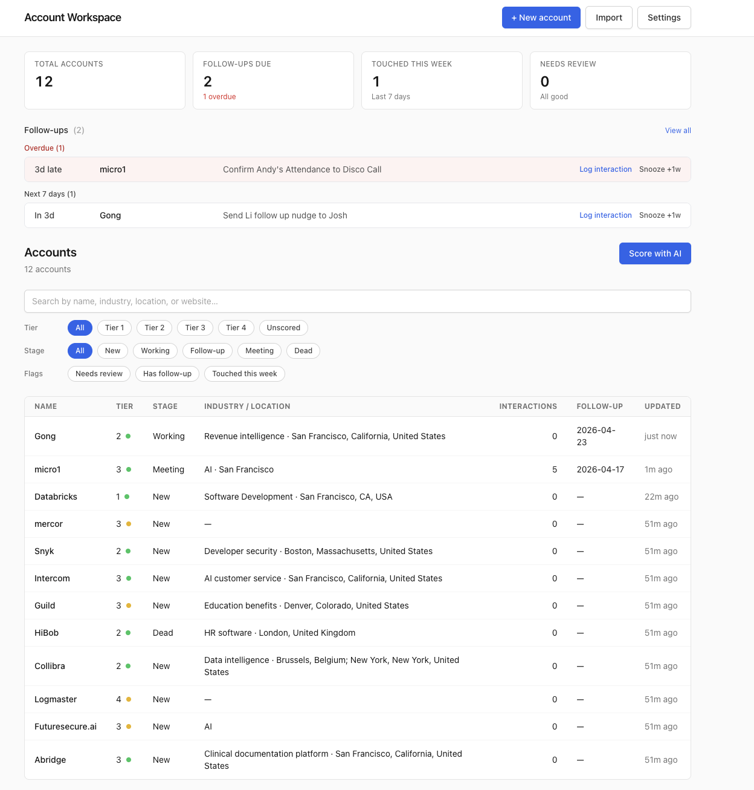
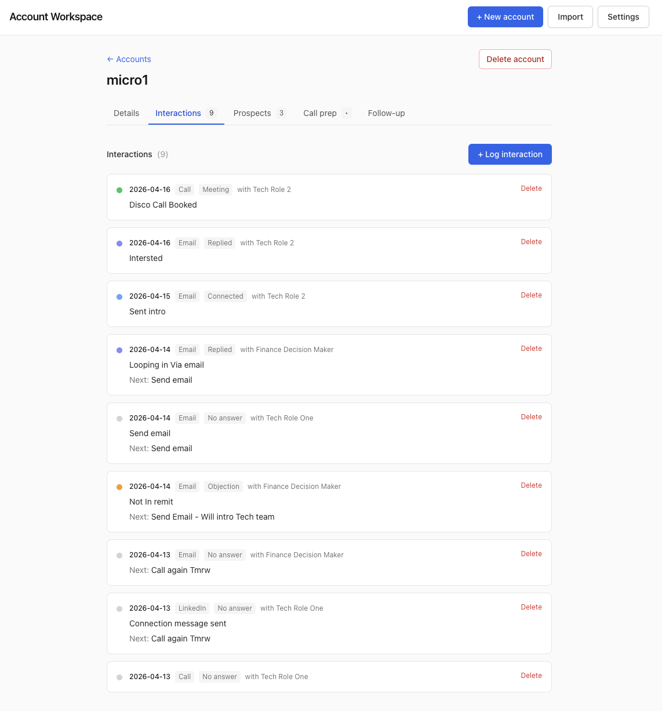
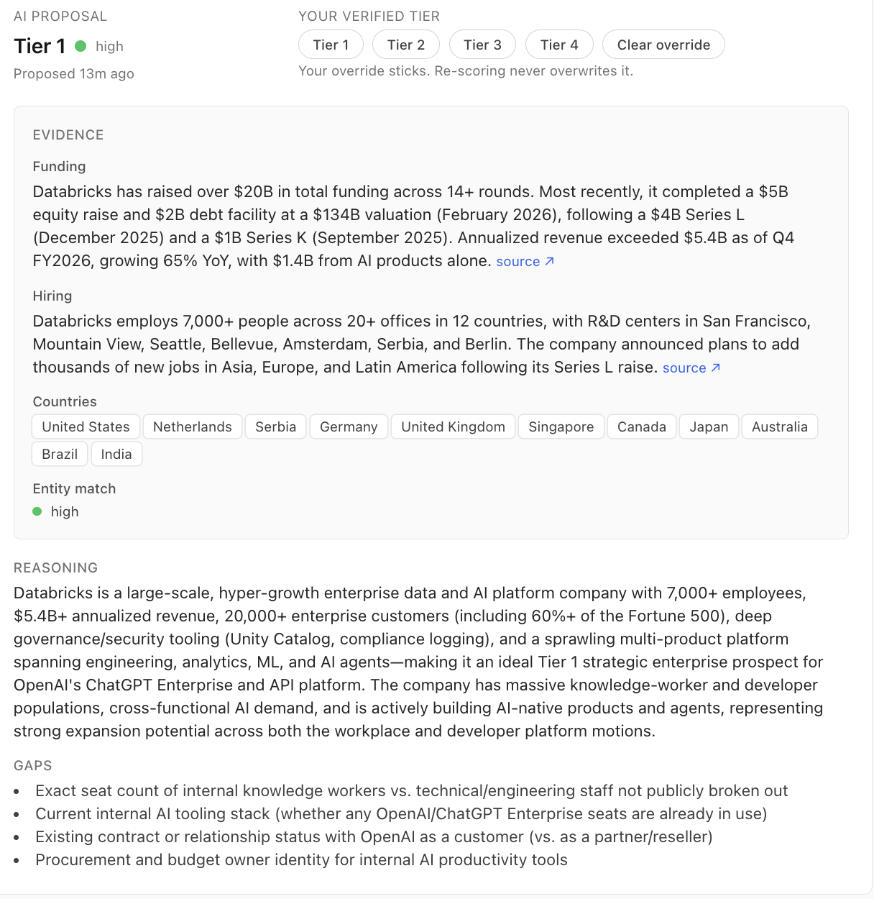
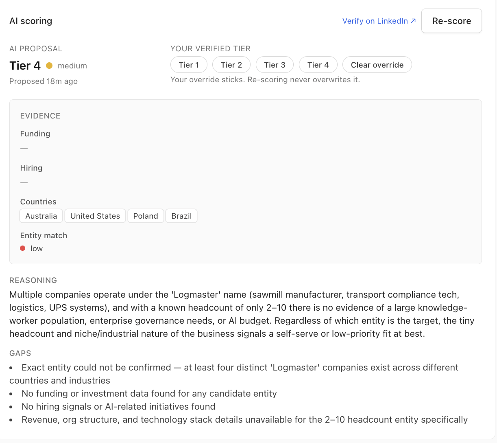
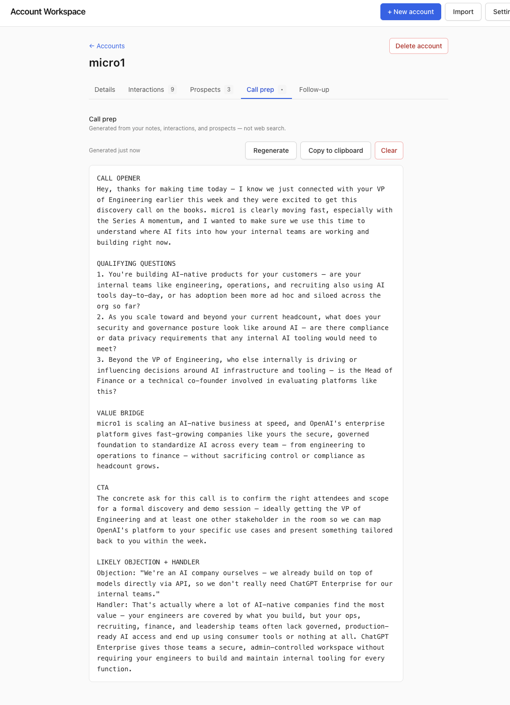
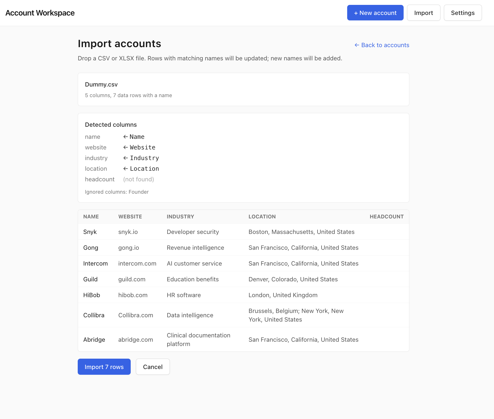
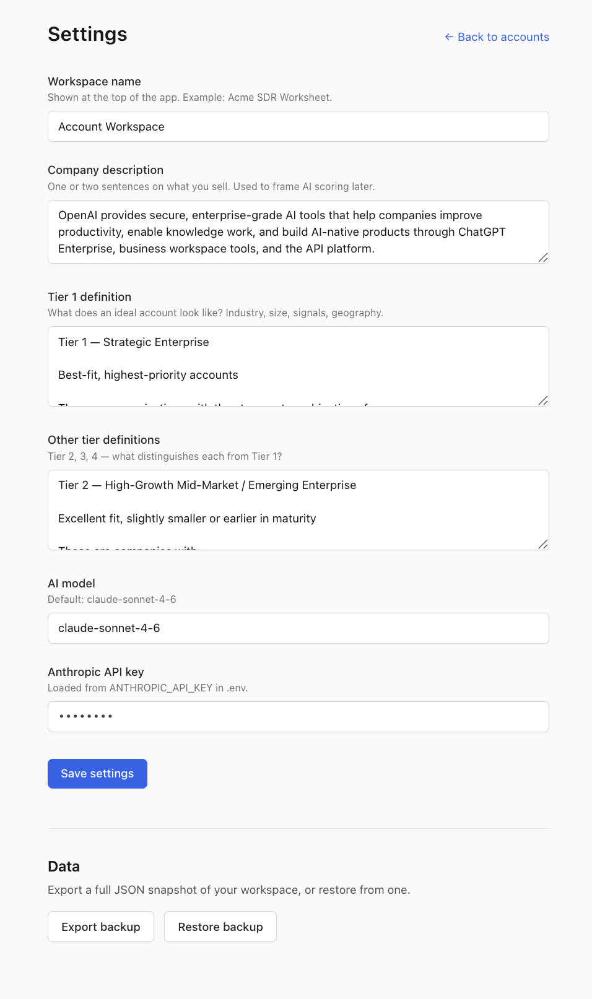
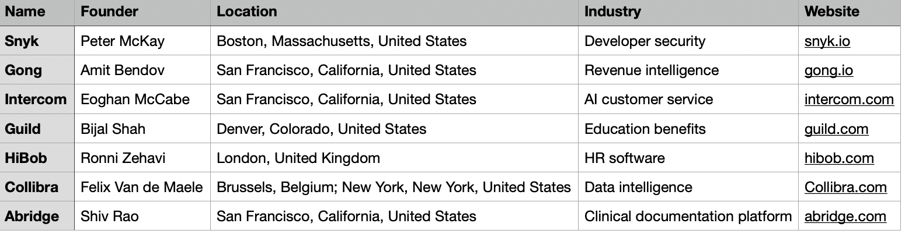

# Account Workspace

A local, single-user tool that replaces the target-account spreadsheet an SDR already keeps on the side, and adds structured interaction history, follow-ups, and AI scoring with evidence.

Screenshots and demo rows are synthetic and stored locally in this repo. They are meant to show the workflow, not customer data.

## What's in it

**Interaction log.** Every touch is a structured row (date, channel, person, outcome, notes, next step), not a free-text blob. You get a timeline per account and filters across accounts. "Show me everyone I connected with this week who didn't book" is a filter, not a search.

**Follow-ups with reasons.** A follow-up date without context rots. Every follow-up carries a `reason` field ("they said call after Q1 earnings") plus a snooze. The dashboard surfaces overdue, today, and the next seven days so nothing quietly slips.

**AI scoring with evidence.** Choose OpenAI or Anthropic in Settings. When you ask the AI to score an account, it returns a tier plus the evidence it found: funding details with source objects, countries the company is in, hiring signals, and a confidence level. You can read the work before you trust it. If you override the tier, the override is sticky, and re-scoring will not overwrite it.

Call prep is also in the app and uses your own notes rather than the open web. Details in [ABOUT.md](ABOUT.md).

## What it doesn't do

- No team features, sharing, or multi-user mode.
- No Salesforce, HubSpot, Gmail, or Outlook integration. No email sending, no sequencing.
- No contact data provider. It won't find new accounts or enrich contacts for you.
- No mobile-native app. Narrow browser widths are usable, but the workflow is designed for a desktop browser.
- Import warns on obvious duplicate names and domains, but it is not a full data-cleaning system.
- Keyboard shortcuts are not wired up yet, even if earlier notes implied otherwise.
- It's beta software. Expect rough edges.

## Who this is for

- SDRs managing roughly 50 to 500 target accounts.
- People running a shadow spreadsheet alongside a company CRM that doesn't prioritize or personalize.
- Willing to do a one-time 20-minute setup (see the quickstart).

## Get started

Head to [QUICKSTART.md](QUICKSTART.md) for prerequisites and a guided first hour. If you've never cloned a repo before, the quickstart assumes that.

## Quick tour

**Scoring evidence.** AI proposes a tier and shows its work — funding, hiring, countries, each with a source URL you can click through.

**Honest about doubt.** When the company name is ambiguous, entity match drops to low and the reasoning tells you which entity the AI actually researched.

**Call prep, rich notes.** Opener, qualifying questions, value bridge, CTA, and a likely objection plus handler — built from your notes, interactions, and prospects, not a fresh web search.

**Thin notes → honest prep.** With no interactions logged, the opener keeps a `[Name]` placeholder instead of inventing a person, and generic questions are tagged as such.

![Call prep output on a sparse account — the opener reads "Hi [Name]" and one qualifying question is annotated "(generic — thin notes)".](screenshots/06-call-prep-thin-notes.png)

**Import preview.** Drag a CSV, see which canonical fields were auto-mapped, which source columns are preserved as imported fields, and which fields weren't found — then click Import.

**Settings.** Workspace name, company description, tier definitions, AI provider, and model — this is what the AI scorer reads before it scores anything.

## Why I built this

The short version: the spreadsheet solves real problems the CRM doesn't, and kept pulling me back even when I tried to quit it. The long version is in [ABOUT.md](ABOUT.md).

## Why this matters for OpenAI SDR work

This is an SDR workflow judgment case study, not just a local CRUD app. The buyer pain is familiar: the CRM is the system of record, but the SDR still keeps a private spreadsheet because prioritization, account context, and call prep are too slow or too generic in the official tooling.

**Target user.** A single SDR managing 50 to 500 named accounts who needs better daily prioritization without adopting a heavy sequencer or handing private notes to another SaaS product.

**Discovery questions.**

- What account signals make you open the spreadsheet instead of the CRM?
- Which tier decisions do you trust AI to propose, and which ones need human verification?
- What proof do you need before acting on an AI-generated score?
- Which manual steps are useful judgment, and which are repeatable admin work?

**Likely objections.**

- "Will this overwrite my judgment?" No. Human tier overrides are sticky.
- "Where does my data go?" Account data stays in local SQLite; API keys stay in `.env`.
- "Can I inspect the AI work?" Yes. Scores show evidence, confidence, gaps, and stale-state indicators.
- "Is this trying to replace Salesforce?" No. It replaces the shadow spreadsheet around Salesforce.

**Short demo script.** Import a synthetic spreadsheet, open the morning queue, score one account with the selected AI provider, verify the evidence, override the tier with chips, log an interaction, set a follow-up, and generate call prep from local context.

The OpenAI-relevant lesson is the product boundary: use AI for evidence-backed suggestions and practical automation, keep the user in control, make uncertainty visible, and avoid pretending a model should own the sales process.

## Feedback I'd like:

- Which spreadsheet columns did this actually replace for you?
- What made you open the spreadsheet anyway?
- Did you book meetings off the call-prep output? Roughly how many?
- What broke, and what felt confusing on day one?

One-line answers to all four beats a long essay on one.

## Ground rules

- Don't import customer or prospect data you don't have permission to hold if on your personal machine. Check with your employer if unsure.
- Don't redistribute the app or the source code to anyone outside the beta.
- All data is stored locally. Use JSON export as the normal backup path. For a raw SQLite backup, stop the app and copy `data/workspace.db`, `data/workspace.db-wal`, and `data/workspace.db-shm` together when the WAL files are present.

## Contact

Nishant T.
nishant.tmg574@gmail.com
+61 416 168 213 (iMessage or Whatsapp)
